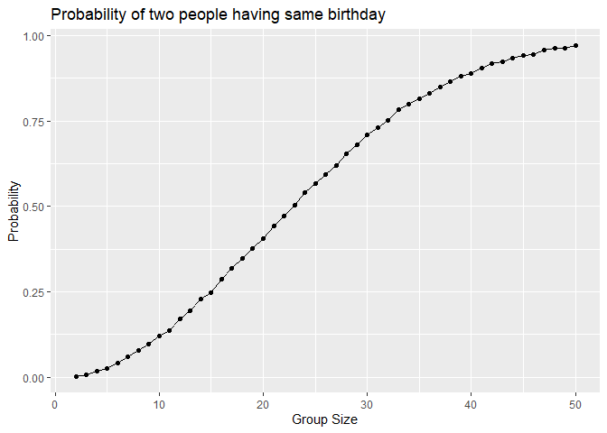
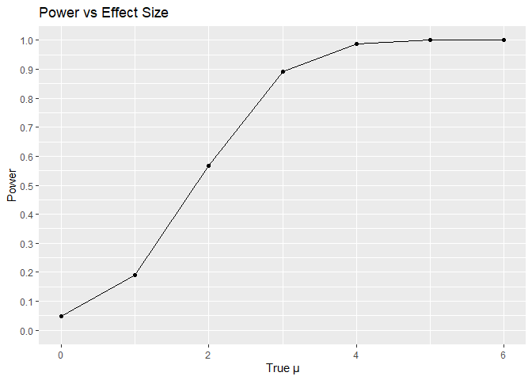
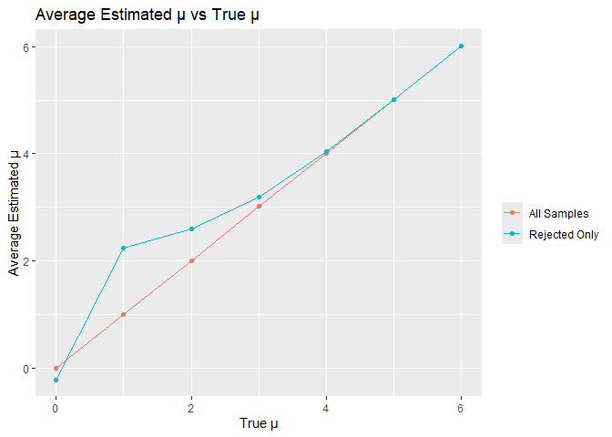
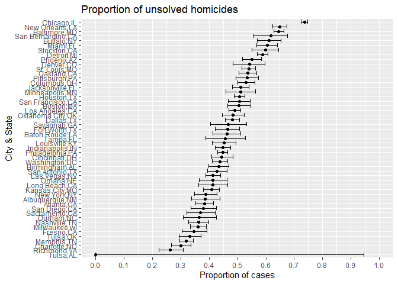

Untitled
================
2025-10-31

``` r
library(tidyverse)
```

    ## ── Attaching core tidyverse packages ──────────────────────── tidyverse 2.0.0 ──
    ## ✔ dplyr     1.1.4     ✔ readr     2.1.5
    ## ✔ forcats   1.0.0     ✔ stringr   1.5.1
    ## ✔ ggplot2   3.5.2     ✔ tibble    3.3.0
    ## ✔ lubridate 1.9.4     ✔ tidyr     1.3.1
    ## ✔ purrr     1.1.0     
    ## ── Conflicts ────────────────────────────────────────── tidyverse_conflicts() ──
    ## ✖ dplyr::filter() masks stats::filter()
    ## ✖ dplyr::lag()    masks stats::lag()
    ## ℹ Use the conflicted package (<http://conflicted.r-lib.org/>) to force all conflicts to become errors

``` r
set.seed(1030)
```

# Problem 1

``` r
birthday_sim = function(n_room){
  birthday = sample(1:365,n_room,replace = TRUE)
  repeated_birthday = length(unique(birthday)) < n_room
  return(repeated_birthday)
}
```

``` r
birthday_sim_results =
  expand_grid(
    group_size = 2:50,
    iter = 1:10000
  ) %>% 
  mutate(
    result = map_lgl(group_size,birthday_sim)
  ) %>% 
  group_by(
    group_size
  ) %>% 
  summarize(
    prob_repeat = mean(result)
  )
birthday_sim_results
```

    ## # A tibble: 49 × 2
    ##    group_size prob_repeat
    ##         <int>       <dbl>
    ##  1          2      0.0026
    ##  2          3      0.0069
    ##  3          4      0.0166
    ##  4          5      0.0259
    ##  5          6      0.0411
    ##  6          7      0.0588
    ##  7          8      0.078 
    ##  8          9      0.098 
    ##  9         10      0.120 
    ## 10         11      0.137 
    ## # ℹ 39 more rows

``` r
birthday_sim_results %>% 
  ggplot(aes(x = group_size,y = prob_repeat)) +
  geom_point() +
  geom_line() +
  labs(
    title = "Probability of two people having same birthday",
    x = "Group Size",
    y = "Probability"
  )
```

<!-- -->

# Comment

This plot visually demonstrates the famous “Birthday Paradox,” a classic
statistical counterintuition. It charts the rapidly increasing
probability that at least two people in a group share a birthday.

Statistically, the curve is not linear but follows a convex,
accelerating path because the number of possible pairings (and thus
collision chances) grows quadratically with group size.

The key insight is how few people are needed for a high probability.
With just 23 people, the probability exceeds 50%, a number far lower
than most people intuitively guess. By a group size of 50, the
probability is near-certainty (97%).

# Problem 2

``` r
sim_ttest = function(n = 30, mu = 0, sigma = 5) {
  
  sim_data = tibble(
    x = rnorm(n, mean = mu, sd = sigma)
    )
  
  ttest_result = t.test(sim_data$x,mu = 0) %>% 
    broom::tidy()
  
  sim_data %>% 
  summarize(
    mu_hat = ttest_result$estimate,
    p_value = ttest_result$p.value
  )
}
```

``` r
sim_results_df = 
  expand_grid(
    true_mu = 0:6,
    iter = 1:5000
  ) %>% 
  mutate(
    ttest_result = map(true_mu, ~sim_ttest(n = 30,mu = .x,sigma = 5))
  ) %>% 
  unnest(ttest_result) %>% 
  mutate(
    rejected = p_value < 0.05
  )
sim_results_df
```

    ## # A tibble: 35,000 × 5
    ##    true_mu  iter  mu_hat p_value rejected
    ##      <int> <int>   <dbl>   <dbl> <lgl>   
    ##  1       0     1  1.37     0.180 FALSE   
    ##  2       0     2 -0.514    0.602 FALSE   
    ##  3       0     3  0.0251   0.978 FALSE   
    ##  4       0     4  0.203    0.816 FALSE   
    ##  5       0     5 -0.744    0.417 FALSE   
    ##  6       0     6  0.681    0.384 FALSE   
    ##  7       0     7  1.60     0.156 FALSE   
    ##  8       0     8  0.580    0.582 FALSE   
    ##  9       0     9 -0.245    0.788 FALSE   
    ## 10       0    10  0.148    0.873 FALSE   
    ## # ℹ 34,990 more rows

``` r
power_results = 
  sim_results_df %>% 
  group_by(true_mu) %>% 
  summarize(
    power = mean(rejected),
    avg_mu_hat = mean(mu_hat)
  )
power_results
```

    ## # A tibble: 7 × 3
    ##   true_mu  power avg_mu_hat
    ##     <int>  <dbl>      <dbl>
    ## 1       0 0.0494    0.00164
    ## 2       1 0.190     1.01   
    ## 3       2 0.566     2.00   
    ## 4       3 0.891     3.02   
    ## 5       4 0.988     4.01   
    ## 6       5 1.000     5.01   
    ## 7       6 1         6.00

``` r
plot1 =
  power_results %>% 
  ggplot(aes(x = true_mu,y = power)) +
  geom_point() +
  geom_line() +
  labs(
    title = "Power vs Effect Size",
    x = "True μ",
    y = "Power") +
  scale_y_continuous(limits = c(0, 1), breaks = seq(0, 1, 0.1))
plot1
```

<!-- -->

## Description

This plot shows the relationship between statistical power and the true
effect size (μ). As the true effect size increases, the power of a
statistical test to detect that effect also increases, forming a
characteristic S-shaped curve. The curve demonstrates that larger true
differences are easier to detect with high probability, while detecting
smaller effects requires more sensitive tests or larger sample sizes to
achieve sufficient power.

``` r
plot2 =
  sim_results_df %>% 
  group_by(true_mu) %>% 
  summarize(
    avg_mu_hat_all = mean(mu_hat),
    avg_mu_hat_rejected = mean(mu_hat[rejected]),
    .groups = "drop"
  ) %>% 
  ggplot(aes(x = true_mu)) +
    geom_point(aes(y = avg_mu_hat_all,color = "All Samples")) +
    geom_line(aes(y = avg_mu_hat_all, color = "All Samples")) +
    geom_point(aes(y = avg_mu_hat_rejected,color = "Rejected Only")) +
    geom_line(aes(y = avg_mu_hat_rejected, color = "Rejected Only")) +
  labs(
    title = "Average Estimated μ vs True μ",
    x = "True μ",
    y = "Average Estimated μ",
    colour = ""
  )
plot2
```

<!-- -->

## Comment

This plot shows the average estimated μ versus the true μ. The “All
Samples” line closely follows the true μ, indicating unbiased
estimation. The “Rejected Only” line, however, deviates above the true
μ, especially for smaller μs. This occurs because statistical
significance filtering selects samples where μ hat is overestimated due
to random variation, leading to selection bias. Thus, the average μ hat
for rejected tests is not equal to the true μ; it is inflated.

## Problem 3

## Description

The raw dataset provides individual-level homicide records compiled from
multiple large U.S. cities and serves as the foundation for estimating
and comparing homicide clearance patterns across jurisdictions.

Each row represents a single victim and contains demographic variables
such as age, sex, and race, along with the date the homicide was
reported.

The dataset also includes geographic identifiers—city, state, and
precise latitude/longitude—which allow aggregation at the city level,
enabling city-specific summaries of total homicides and unsolved cases.

A key variable for this analysis is disposition, which documents whether
each case was closed by arrest, closed without arrest, or remains open.
This categorical field is essential for identifying unsolved homicides
and computing proportions that will later be evaluated with statistical
inference.

Overall, the dataset is structured, detailed, and sufficiently granular
to support city-level summarization, hypothesis testing, and uncertainty
estimation for clearance rates.

``` r
homicides = read_csv("./data/homicide-data.csv") %>% 
  mutate(
    city_state = paste(city,state,sep = ",")
  )
```

    ## Rows: 52179 Columns: 12
    ## ── Column specification ────────────────────────────────────────────────────────
    ## Delimiter: ","
    ## chr (9): uid, victim_last, victim_first, victim_race, victim_age, victim_sex...
    ## dbl (3): reported_date, lat, lon
    ## 
    ## ℹ Use `spec()` to retrieve the full column specification for this data.
    ## ℹ Specify the column types or set `show_col_types = FALSE` to quiet this message.

``` r
summarize_cities = 
  homicides %>% 
  group_by(city_state) %>% 
  summarize(
    total = n(),
    unsolved = sum(disposition %in% c("Closed without arrest","Open/No arrest"))
  )
summarize_cities
```

    ## # A tibble: 51 × 3
    ##    city_state     total unsolved
    ##    <chr>          <int>    <int>
    ##  1 Albuquerque,NM   378      146
    ##  2 Atlanta,GA       973      373
    ##  3 Baltimore,MD    2827     1825
    ##  4 Baton Rouge,LA   424      196
    ##  5 Birmingham,AL    800      347
    ##  6 Boston,MA        614      310
    ##  7 Buffalo,NY       521      319
    ##  8 Charlotte,NC     687      206
    ##  9 Chicago,IL      5535     4073
    ## 10 Cincinnati,OH    694      309
    ## # ℹ 41 more rows

``` r
baltimore =
  summarize_cities %>% 
  filter(city_state == "Baltimore,MD")

baltimore_prop =
  prop.test(baltimore$unsolved,baltimore$total)
  
baltimore_tidy =
  broom::tidy(baltimore_prop)
  
baltimore_outcome =
  tibble(
    baltimore_estimate = baltimore_tidy %>% pull(estimate),
    baltimore_conf_low = baltimore_tidy %>% pull(conf.low),
    baltimore_conf_high = baltimore_tidy %>% pull(conf.high))
baltimore_outcome
```

    ## # A tibble: 1 × 3
    ##   baltimore_estimate baltimore_conf_low baltimore_conf_high
    ##                <dbl>              <dbl>               <dbl>
    ## 1              0.646              0.628               0.663

``` r
prop_all_cities =
  summarize_cities %>% 
  mutate(
    cities_outcome = map2(unsolved,total,~broom::tidy(prop.test(.x,.y)))
  ) %>% 
  unnest(cities_outcome)
```

    ## Warning: There was 1 warning in `mutate()`.
    ## ℹ In argument: `cities_outcome = map2(unsolved, total,
    ##   ~broom::tidy(prop.test(.x, .y)))`.
    ## Caused by warning in `prop.test()`:
    ## ! Chi-squared approximation may be incorrect

``` r
prop_all_cities
```

    ## # A tibble: 51 × 11
    ##    city_state     total unsolved estimate statistic   p.value parameter conf.low
    ##    <chr>          <int>    <int>    <dbl>     <dbl>     <dbl>     <int>    <dbl>
    ##  1 Albuquerque,NM   378      146    0.386   19.1    1.23e-  5         1    0.337
    ##  2 Atlanta,GA       973      373    0.383   52.5    4.32e- 13         1    0.353
    ##  3 Baltimore,MD    2827     1825    0.646  239.     6.46e- 54         1    0.628
    ##  4 Baton Rouge,LA   424      196    0.462    2.27   1.32e-  1         1    0.414
    ##  5 Birmingham,AL    800      347    0.434   13.8    2.05e-  4         1    0.399
    ##  6 Boston,MA        614      310    0.505    0.0407 8.40e-  1         1    0.465
    ##  7 Buffalo,NY       521      319    0.612   25.8    3.73e-  7         1    0.569
    ##  8 Charlotte,NC     687      206    0.300  109.     1.41e- 25         1    0.266
    ##  9 Chicago,IL      5535     4073    0.736 1231.     1.28e-269         1    0.724
    ## 10 Cincinnati,OH    694      309    0.445    8.11   4.41e-  3         1    0.408
    ## # ℹ 41 more rows
    ## # ℹ 3 more variables: conf.high <dbl>, method <chr>, alternative <chr>

``` r
plot3 =
  prop_all_cities %>% 
  arrange(desc(estimate)) %>% 
  mutate(city_state = fct_reorder(city_state,estimate)) %>% 
  ggplot(aes(x = city_state,y = estimate)) +
  geom_point() +
  geom_errorbar(aes(ymin = conf.low, ymax = conf.high)) +
  coord_flip() +
  labs(
    title = "Proportion of unsolved homicides",
    x = "City & State",
    y = "Proportion of cases") +
  scale_y_continuous(limits = c(0, 1), breaks = seq(0, 1, 0.1))
plot3
```

<!-- -->
